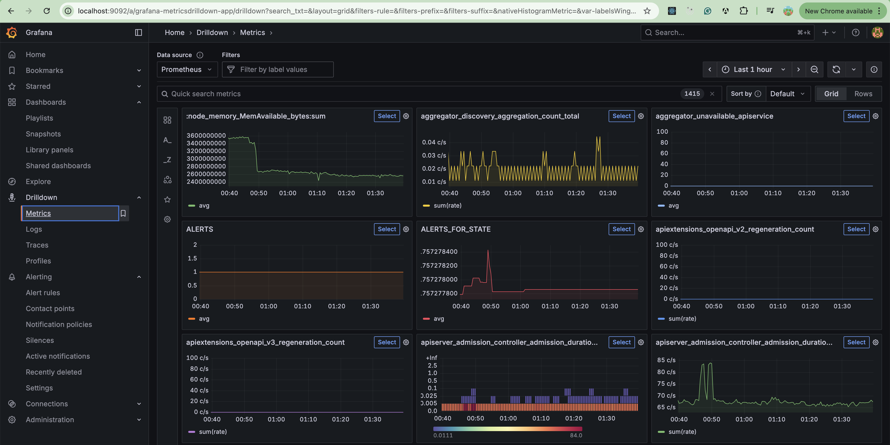
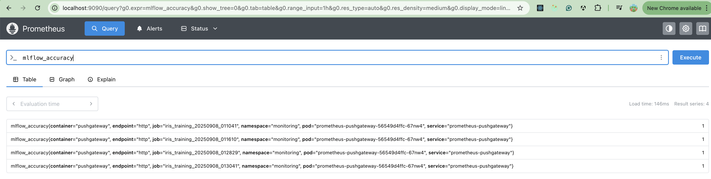
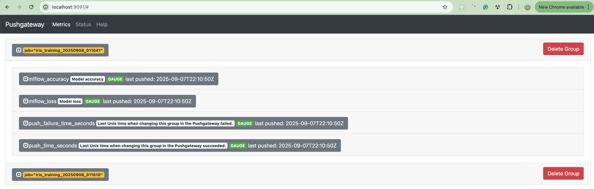
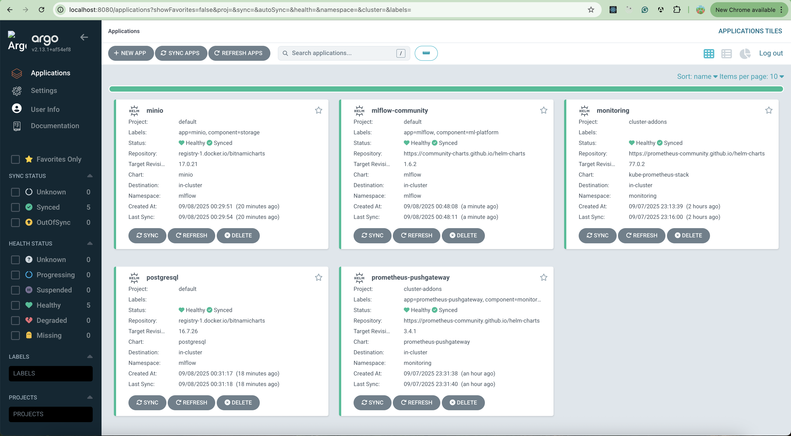
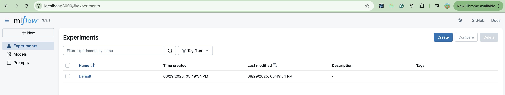
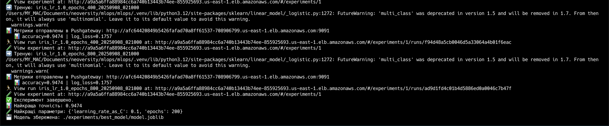
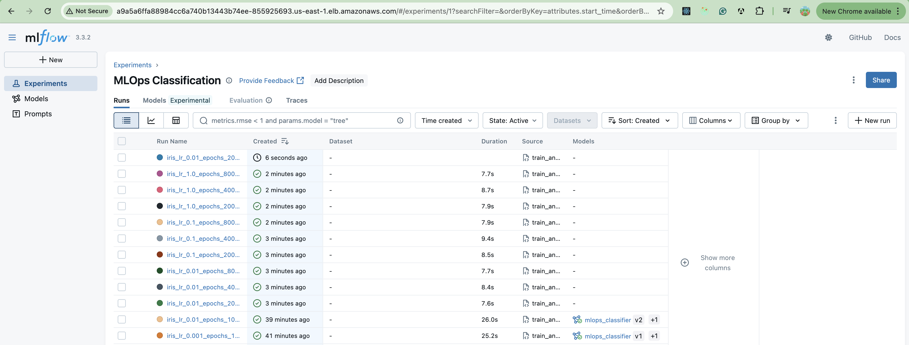
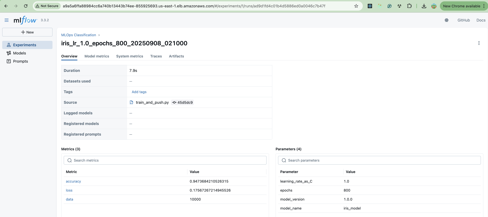
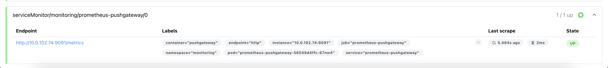
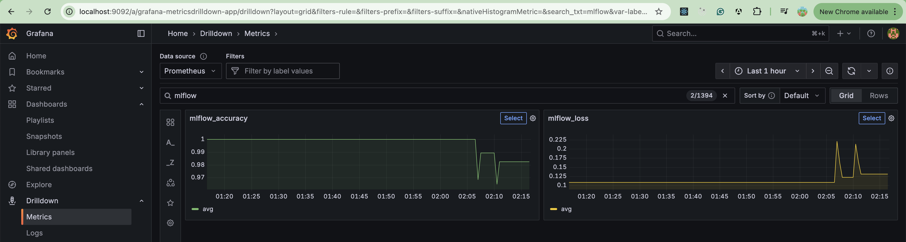

# mlops

Repository for managing MLOps processes associated with deploying machine learning models.

# EKS VPC Cluster Infrastructure

Terraform Infrastructure as Code for deploying an AWS VPC, an Amazon EKS (Kubernetes) cluster, and Argo CD.

## Project Description

This project provides a modular Terraform configuration to automatically provision a production-ready AWS environment that includes:

- **VPC** — a virtual private cloud with public and private subnets.
- **EKS Cluster** — a managed Kubernetes cluster with two CPU node groups.
- **Argo CD** — GitOps-based continuous delivery for Kubernetes applications.

# Project installation

## 1. Terraform initialization

```
terraform init
```

## 2. To check future infrastructure

```
terraform plan
```

## 3. Infrastructure deployment

```
terraform apply
```

## 4. Connect to Kubernetes cluster (kubectl installation)

```
aws eks update-kubeconfig --region us-east-1 --name goit-mlops-eks-cluster
```

## 5. To check cluster status

```
kubectl get nodes
kubectl get pods --all-namespaces
kubectl get all --all-namespaces
```

# Modules

## VPC Module

- Creates a **VPC** with public and private subnets (spread across multiple Availability Zones).
- Provisions an **Internet Gateway** and a **NAT Gateway** for secure outbound access from private subnets.
- Configures **route tables** and **security groups** with sensible defaults.

## EKS Module

- Deploys the **Amazon EKS control plane**.
- Creates **two CPU-focused managed node groups** (size and instance types can be configured).
- Sets up **cluster authentication (aws-auth)** and baseline **RBAC**.
- Installs essential **EKS add-ons** (e.g., VPC CNI, CoreDNS, kube-proxy).

## Argo CD Module

- Installs **Argo CD** in the cluster via the official **Helm chart** (in a dedicated namespace).
- Optionally bootstraps **Projects** and **Applications** from a Git repository (GitOps workflow).
- Supports **sync policies** (manual or auto-sync) and built-in **health/status checks**.
- Exposes the Argo CD UI (using port-forward for local use).

---

# MLFlow Helm chart deployment using ArgoCd

## 1.Get all resources and services in argocd namespace

```
kubectl get all -n argocd
kubectl get svc -n argocd
```

## 2. Get and encode admin secret for ArgoCD UI login

```
kubectl -n argocd get secret argocd-initial-admin-secret -o jsonpath="{.data.password}" | base64 -d
```

## 3. Forward port ArgoCD server port to local computer

```
kubectl port-forward svc/argocd-server -n argocd 8080:80
```

## 4. Login to ArgoCD UI

Visiting [localhost:8080](localhost:8080) in your browser and login to ArgoCD UI using obtained in step 2 password and username "admin"

## 4.a. Optional Step. Invalid credentials.

With multiple argocd-server replicas can happen that the initial password in argocd-initial-admin-secret doesn’t match the active bcrypt hash in argocd-secret. Follow the next steps to regenerate new secret.

- Scale to a single replica to avoid races

```
kubectl -n argocd scale deploy/argocd-server --replicas=1
```

- Clear current admin password and initial secret

```
kubectl -n argocd patch secret argocd-secret -p '{"data": {"admin.password": null, "admin.passwordMtime": null}}'
kubectl -n argocd delete secret argocd-initial-admin-secret --ignore-not-found
kubectl -n argocd rollout restart deploy/argocd-server
```

- Get the fresh initial password

```
kubectl -n argocd get secret argocd-initial-admin-secret -o jsonpath='{.data.password}' | base64 -d; echo
```

## 4.b. Optional Step. Cluster default storage class setup.

If you will get an error at pod initialization connected with cluster storage class, you have to setup default cluster storage class manually.
For this apply sc.yaml manifest to your cluster:

```
kubectl apply -f ./manifests/sc.yaml
```

- check existing storage classes:

```
kubectl get sc
```

- set up newly created storage class as default if is not yet:

```
kubectl annotate sc ebs-sc-gp3 storageclass.kubernetes.io/is-default-class="true" --overwrite
```

- remove default from all other storage classes

```
kubectl annotate sc gp2 storageclass.kubernetes.io/is-default-class- || true
```

## 5. Add Monitoring Tools (Prometheus, Grafana and PushGateway)

- create project cluster-addons:

```
kubectl apply -f  ./argocd/applications/project.addons.yaml
```

- add Prometheus and Grafana using Prometheus helm chart:

```
kubectl apply -f ./argocd/applications/prom.yaml
```

- add PushGateway for sending metrics to Prometheus

```
kubectl apply -f  ./argocd/applications/pushgateway.yaml
```

- get all resources and services:

```
kubectl get all -n monitoring
kubectl get svc -n monitoring
```

- get secrets to Graphana UI

```
kubectl get secret -n monitoring monitoring-grafana -o jsonpath='{.data.admin-password}' | base64 -d; echo
```

- forward Grafana port to local computer:

```
kubectl port-forward svc/monitoring-grafana 9092:80 -n monitoring
```

- Login to Grafana UI using username "admin" and obtained password (visit in browser [localhost:9092](localhost:9092))



- forward Prometheus port to local computer:

```
kubectl port-forward svc/monitoring-kube-prometheus-prometheus 9090:9090 -n monitoring
```

- Visit Prometheus UI following the next link [localhost:9090](localhost:9090)



- forward Prometheus PushGateway port to local computer:

```
kubectl port-forward svc/prometheus-pushgateway 9091:9091 -n monitoring
```

- Visit Prometheus PushGateway UI following the next link [localhost:9091](localhost:9091)



## 6. Add MLFlow application

- Add the Bitnami OCI Helm repo to Argo CD

```
kubectl apply -f ./argocd/applications/bitnami-oci.yaml
```

- Apply secrets, minio, postgres and mlflow applications to your cluster:

```
kubectl apply -f ./argocd/applications/mlflow-secrets.yaml
kubectl apply -f ./argocd/applications/minio.yaml
kubectl apply -f ./argocd/applications/postgresql.yaml
kubectl apply -f ./argocd/applications/mlflow-community.yaml
```

Now you can check the status of deployment in ArgoCD UI interface in "Applications" section.



## 5. MLflow launch

- get MLFlow pods and services:

```
kubectl get pods -n mlflow
kubectl get svc -n mlflow
```

- get MLFlow login credentials

```
echo Username: $(kubectl get secret -n mlflow mlflow-secrets -o jsonpath="{ .data.admin-username }" | base64 -d)
echo Password: $(kubectl get secret -n mlflow mlflow-secrets -o jsonpath="{.data.admin-password }" | base64 -d)
```

- set these secrets into .env file

- forward MLFlow server port to local computer or visit direct LoadBalancer url (pointing http and correct port)

```
kubectl port-forward svc/mlflow-tracking -n mlflow 3000:80
```

- login to MLFlow UI

Visit [localhost:3000](localhost:3000) in your browser and login to MLFlow UI using obtained in previous step password and username



🎉 **Congrats! Your MLflow app is ready for models training and experiments tracking.**

## 6. Train model

- create and activate python environment

```
python3 -m venv .venv
source .venv/bin/activate
```

- install dependencies

```
pip install -r ./experiments/requirements.txt
```

- check if all necessary variables were set and secrets into .env file

- apply .env variables

```
source ./.env
```

- run model training with different parameters, push metrics to Prometheus and Grafana and store model with the highest accuracy

```
python3 ./experiments/train_and_push.py
```

- open the url to MLFlow that appears in console. You can observe model training run with all details.
  
  
  

- check if Prometheus PushGateway appears in Prometheus/Status/Target Heals endpoints list ([localhost:9090](localhost:9090))
  

- Observe mlflow metrics in Grafana/Drilldown/Metrics and filter by "mlflow" name



## Destroy resources

Delete all argocd applications:

```
kubectl -n argocd delete application postgresql --ignore-not-found
kubectl -n argocd delete application minio --ignore-not-found
kubectl -n argocd delete application mlflow-community --ignore-not-found
```

```bash
terraform destroy
```
