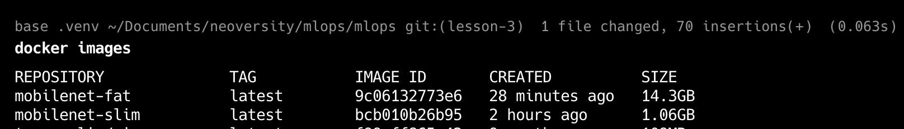
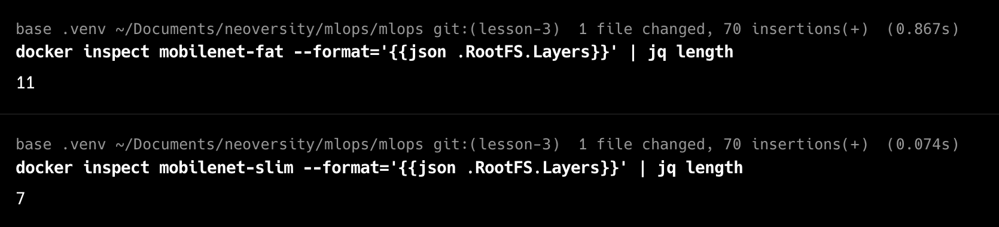

# Model prediction results:

```
Image: /app/dog_test.jpg
Top-3 predictions:
1. Labrador retriever — 19.25% (id=208)
2. Saluki — 3.71% (id=176)
3. dingo — 2.70% (id=273)
```

➡️ The model correctly identifies the dog breed, with **Labrador retriever** ranked as the top prediction.

```
Image: /app/cat_test.png
Top-3 predictions:
1. tabby — 8.11% (id=281)
2. Persian cat — 6.00% (id=283)
3. Egyptian cat — 3.14% (id=285)
```

➡️ The model confidently recognizes cat breeds, with **Tabby** as the top prediction, followed by **Persian** and **Egyptian cat**.

---

✅ Overall, the results are **plausible and reasonably accurate** for the provided test images, showing that the TorchScript MobileNetV2 model is functioning as expected in the containerized environment.

# Fat and Slim Docker-images comparison:

## 📦 Image sizes:

```
docker images mobilenet-fat mobilenet-slim
```



There is a clear and significant difference. The slim version is ~13x smaller than the fat one.

## 🪜 Number of layers:

```
docker inspect mobilenet-fat --format='{{json .RootFS.Layers}}' | jq length
docker inspect mobilenet-slim --format='{{json .RootFS.Layers}}' | jq length
```



The slim build reduces the total number of layers while still including all dependencies needed for inference.

## Extra Tools in Fat Image

- The fat image includes unnecessary system tools and caches:
  - `build-essential`, `git`, `curl`, `wget`, `ffmpeg`, etc.
  - Cached APT packages not removed on purpose.
  - Heavy CUDA-related wheels of PyTorch and TorchVision (downloaded by default without CPU-only index).
- These add up to significant overhead and slow down image pull and startup times.

## Optimization Suggestions

- **Use CPU-only wheels** (as done in the slim version) to avoid large CUDA dependencies.
- **Use smaller base images** such as `python:slim`, or even `distroless` Python runtime for minimal footprint.
- **Avoid build-time tools** in the runtime stage by leveraging multi-stage builds (already applied in slim).
- **Reduce dependencies**: install only what is required for inference (e.g., `torch`, `torchvision`, `pillow`).
- **Consider TorchScript-lite or ONNX** for further reduction in runtime dependencies and faster inference.
- **Clean up build artifacts and caches** wherever possible to shrink the final image.

---

### Conclusion

The fat image demonstrates the drawbacks of a monolithic build: very large size, unnecessary layers, and extra tools.  
The slim image, on the other hand, shows how multi-stage builds and CPU-only packages can reduce the footprint drastically while keeping functionality intact.
